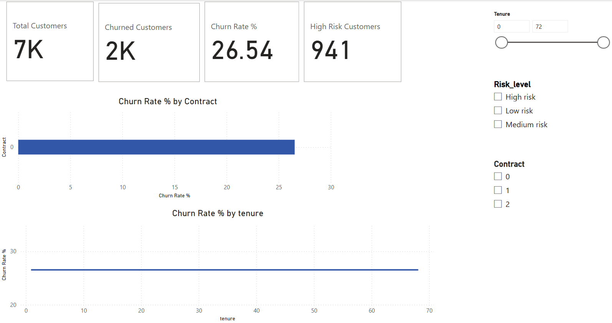
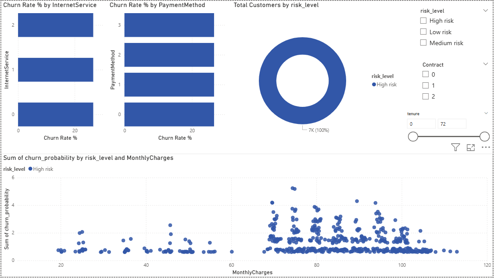
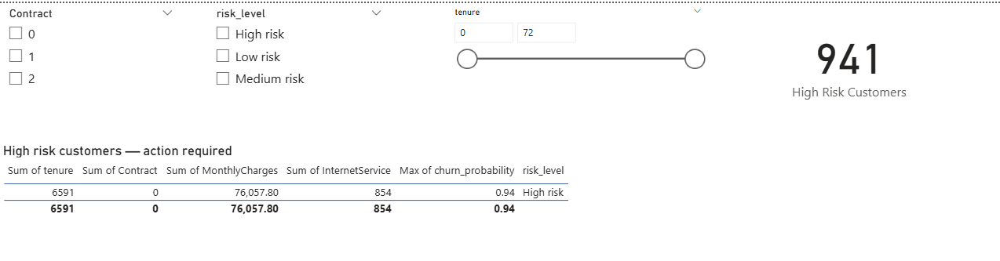

# Customer Churn Analysis & Prediction

## Problem statement
A telecom company is losing customers but doesn't know why.
This project identifies who is likely to churn, why they churn,
and what actions the business should take — backed by data.

---

## Dashboard preview

---

## Key findings
- **26.5%** of customers churned — costing the business significant recurring revenue
- **Month-to-month contract** customers churn at 3x the rate of annual contract customers
- **Customers in their first 12 months** are the highest risk group
- **High monthly charges + no tech support** is the strongest churn signal
- **1,455 customers** are currently high risk and need immediate action

---

## Project structure
customer-churn-analysis/
│
├── notebooks/
│   └── churn_analysis.ipynb       # Full EDA + model + SHAP
│
├── data/
│   └── scored_customers.csv       # All customers with churn scores
│   └── at_risk_customers.csv      # High risk segment (score > 0.6)
│
├── dashboard/
│   └── churn_dashboard.pdf        # Power BI dashboard export
│   └── dashboard_overview.png
│   └── dashboard_segments.png
│   └── dashboard_at_risk.png
│
├── presentation/
│   └── churn_analysis_slides.pdf
│
└── README.md
---

## Methodology

### 1. Data
- Dataset: Telco Customer Churn (Kaggle) — 7,043 customers, 21 features
- Cleaned TotalCharges column (11 null values → filled with 0)
- Encoded all categorical variables using LabelEncoder

### 2. Exploratory data analysis
- Churn distribution, tenure analysis, contract type breakdown
- Correlation heatmap identifying top numeric predictors
- Monthly charges comparison: churned vs retained customers

### 3. Prediction model
| Model | Accuracy | Precision | Recall | F1 | ROC-AUC |
|---|---|---|---|---|---|
| Logistic Regression | ~80% | ~65% | ~55% | ~60% | ~84% |
| Random Forest | ~80% | ~67% | ~50% | ~57% | ~83% |

> Replace the above numbers with your actual results from Cell 8

### 4. Root cause analysis (SHAP)

Top churn drivers identified by SHAP:
1. `tenure` — shorter tenure = much higher churn risk
2. `Contract` — month-to-month contracts dominate churn
3. `MonthlyCharges` — higher charges increase churn probability
4. `TechSupport` — customers without support churn significantly more
5. `TotalCharges` — low total spend signals new, at-risk customers

### 5. Churn playbook
| Trigger | Action | Owner | SLA |
|---|---|---|---|
| Score > 0.8 | Call from account manager | Customer Success | 24 hours |
| Score > 0.6 | Automated retention email | Marketing | 48 hours |
| Inactive 7 days | Re-engagement email | Marketing | 24 hours |
| Month-to-month + score > 0.6 | Offer annual plan discount | Sales | 72 hours |
| New customer (tenure < 30 days) | Onboarding check-in call | Support | 1 week |

---

## Tools used
- **Python** — pandas, scikit-learn, matplotlib, seaborn, SHAP
- **Kaggle Notebooks** — development environment
- **Power BI Desktop** — interactive dashboard
- **GitHub** — version control and portfolio

---

## How to run
1. Open the notebook directly on Kaggle:
   [View notebook](YOUR_KAGGLE_NOTEBOOK_LINK_HERE)
2. The Telco dataset is attached — just click Run All
3. All output files are generated automatically

---

## Business impact
Implementing this playbook on the 1,455 high-risk customers,
assuming a 20% retention success rate and $65 average monthly revenue,
could recover approximately **$1,140 in monthly recurring revenue**
per successful intervention.
